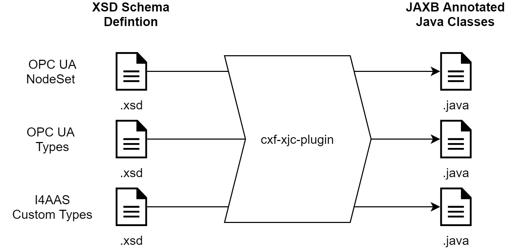
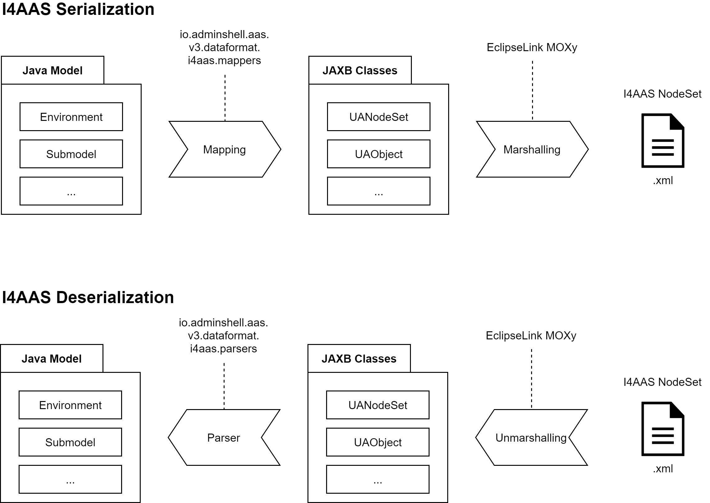

# Java Dataformat UA NodeSet

## Important Remarks regarding I4AAS NodeSet

The OPC UA Companion Specification as published by [opcfoundation.org](https://opcfoundation.org/developer-tools/specifications-opc-ua-information-models/opc-ua-for-i4-asset-administration-shell/) currently targets AAS Version 2. Since the core model is build on Version 3, an **unofficial pre-release version I4AAS V3** is used.

You can find the pre-release UA NodeSet as XML file under /nodeset/i4aas as well as all changes documented in a CSV file.

## Generated JAXB Classes

The UA NodeSet de/serializer is based on JAXB annotated classes, generated from 3 XSD files (/nodeset/xsd), which you can also extract from the pom.xml. The execution with id *generate-uatypes-classes* is deactivated since minor manual changes were necessary so that the XML namespaces are set correctly. To prevent overrides, these generated, then adjusted classes for *generate-uatypes-classes* are copy-pasted from /target/generated/src/main/java to /src/main/java If you need to update these classes, consider to change the execution phase to *generate-sources*.

## Implementation Overview

The basic idea is to use the JAXB classes as intermediate for serialization and deserialization. Since these classes are generated from schema, the generated output is always as good as the JAXB marshaller handles these classes.

The core logic about the mapping rules according to I4AAS is implemented in the mapping (serialization) or parser (deserialization) packages.

