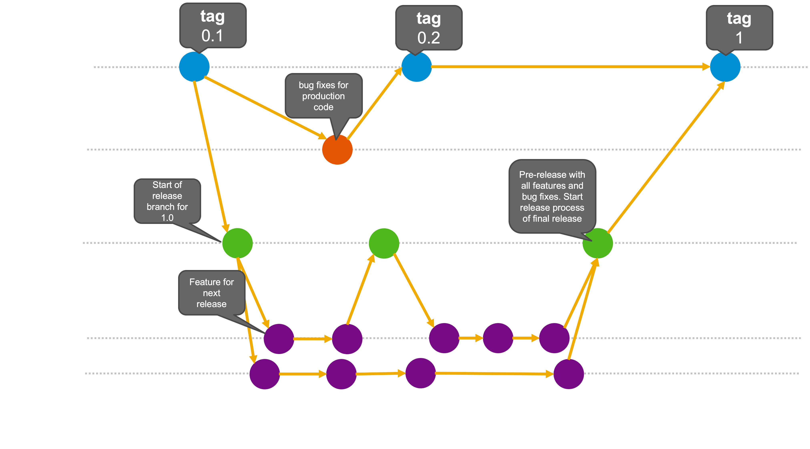

# Development Process

Reference to [Issue #32](https://github.com/eclipse-digitaltwin/aas4j/issues/32)

## Branch Conventions

Possible branches can be classified between *main* and *support* branching.
The *main* branches are :
- `main` branch: This branch contains the production-ready code that can be released or is released.

The `supporting` branches are:
- `feature` branch: This branch can be used to implement new features for the next releases.
- `release` branch: This branch supports the preparation to new releases and only accepts commits (e.g.m minor bug fixes) to stabilize a version of the ready for release (production ready). Release branches should not be created for every release but only per minor version, e.g. `release-v3.1.0`. Each release should be created as a tag.
- `bugfixes` branch: This branch captures work to fix an urgent production defect (issues, error, instabilities, vulnerabilities, ...).

## Processes

- Once the `main` branch achieves the development goals, is stable (production-ready) and ready for release.
- `feature` branch *may* branch off from `main` branch but *must* merge back into the `release` branch only.
- `release` branch *may* branch off from `main` branch but *must* merge into `main` and `release` branch with the naming convention `release-*`(e.g., `release-v3.1.0`).
- `bugfix` branch *must* branch off from the `main` branch and *must* merge back into `main`and the respective `release` branch with the naming convention `bugfix-*`(e.g., `bugfix-v3.1.1` ).

> **Housekeeping:** Only permanent branches are main, develop, release-v0.0.x; other branches are deleted once merged.

## Releases

- `main` branch reflects *major*, *minor*, and *service* releases that *must* have followed the review process defined in the [Eclipse Handbook](https://www.eclipse.org/projects/handbook/#release).
- `release` branch can also reflect a milestone build and release (pre-releases under Eclise Foundation).
- `bugfix` branch can be used to keep dependecies updated and, consequently, only the latest version will be updated.

Resources:
- https://nvie.com/posts/a-successful-git-branching-model/
- https://martinfowler.com/articles/branching-patterns.html
- https://www.gitkraken.com/learn/git/git-flow

